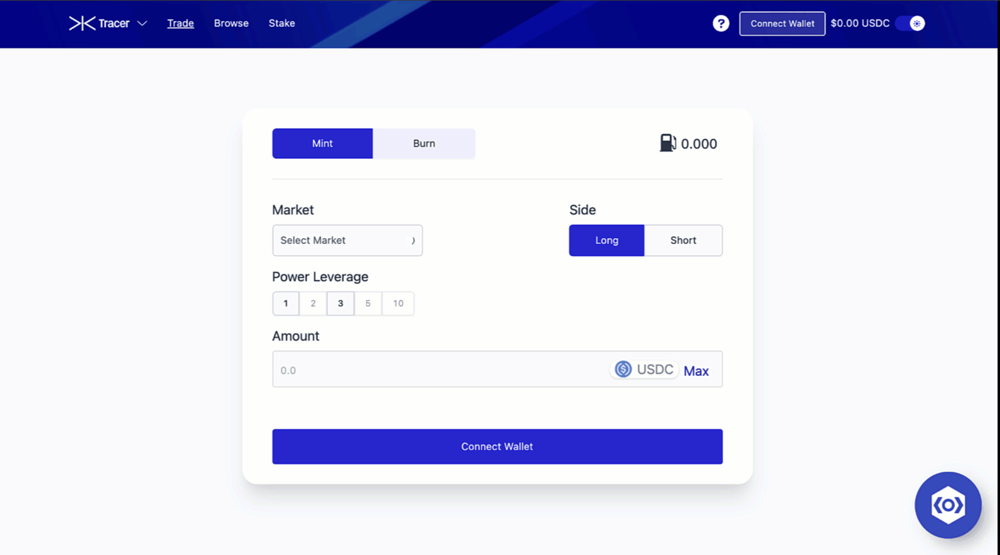

Script which uses selenium to run a headless chromium browser to scrape values from Perpetual Pools and Arbitrum Balancer and sends an SMS notification 
containing the token pairs for which the percentage difference is greater than X%. Allows arbitrage opportunities to be identified and exploited.

